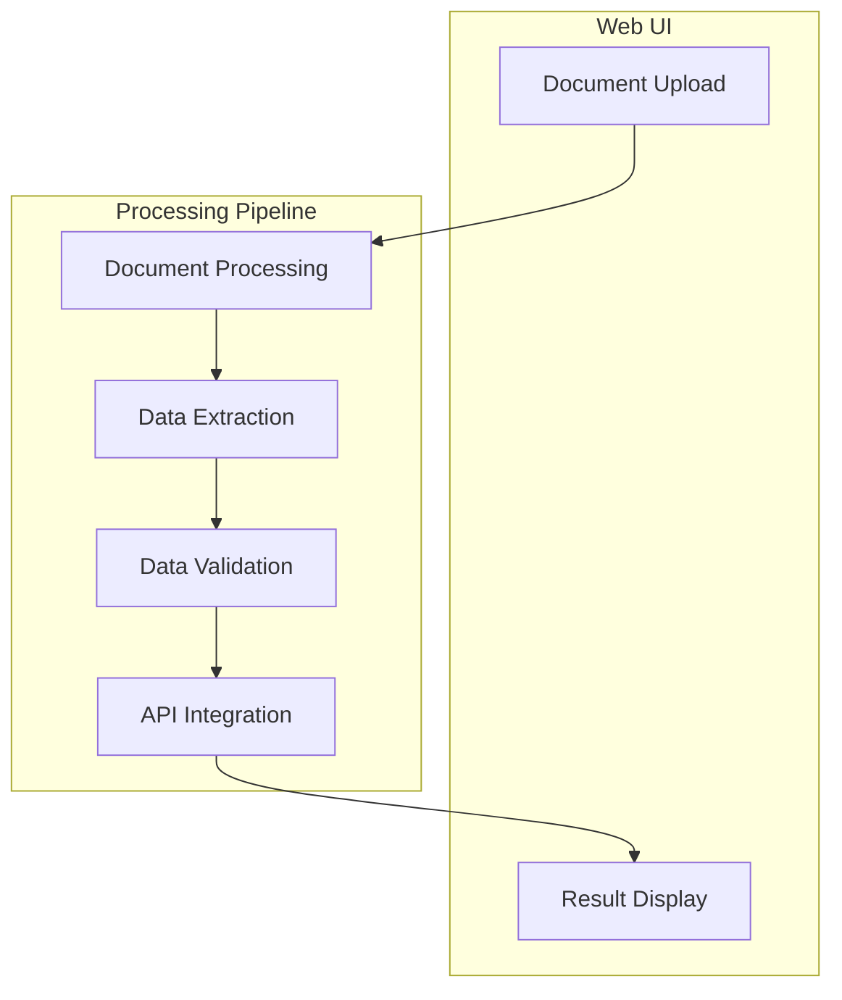

# Zoho Expense Creator Design

## Overview

The Zoho Expense Creator is an AI-powered system that automates the process of creating expense entries in Zoho Books from various document formats. The system uses Gemini AI for document processing and follows a structured flow to ensure accurate and reliable expense creation.

## System Architecture

## Components

### 1. Web Interface (Streamlit)
- **Purpose**: User-friendly interface for document upload and result visualization
- **Features**:
  - Document upload (PDF, images)
  - Processing status display
  - Result review and confirmation
  - Error handling and feedback

### 2. Document Processing Pipeline
- **Input**: PDF/Image documents
- **Processing Steps**:
  1. Document loading and preprocessing
  2. Data extraction using Gemini AI
  3. Data validation and formatting
  4. API integration

### 3. Data Models
- **Expense Model**: Structured representation of expense data
- **Validation Rules**: Business rules for expense validation
- **API Models**: Models for API integration

### 4. Node-based Processing
The system uses a node-based architecture for processing:

Each node handles a specific task:
- **LoadDocumentNode**: Document loading and preprocessing
- **ProcessWithGeminiNode**: AI-powered data extraction
- **ValidateDataNode**: Data validation and formatting
- **CreateEntryNode**: API integration

## Error Handling

The system implements comprehensive error handling:
1. **Document Processing Errors**:
   - Invalid file formats
   - Corrupted documents

2. **Data Extraction Errors**:
   - Unreadable text
   - Incomplete information
   - Format inconsistencies

3. **Validation Errors**:
   - Invalid categories
   - Missing required fields
   - Amount format issues

4. **API Integration Errors**:
   - Authentication failures
   - Rate limiting
   - Network issues

## Security Considerations

1. **API Keys**:
   - Stored in environment variables
   - Never committed to version control
   - Rotated regularly

2. **Data Privacy**:
   - Documents processed locally
   - Temporary storage only
   - Secure API communication

## Future Enhancements

1. **Features**:
   - Batch processing
   - Custom validation rules
   - Multi-language support

2. **Integration**:
   - Additional systems
   - Cloud storage integration
   - Email processing

3. **Performance**:
   - Parallel processing
   - Caching mechanisms
